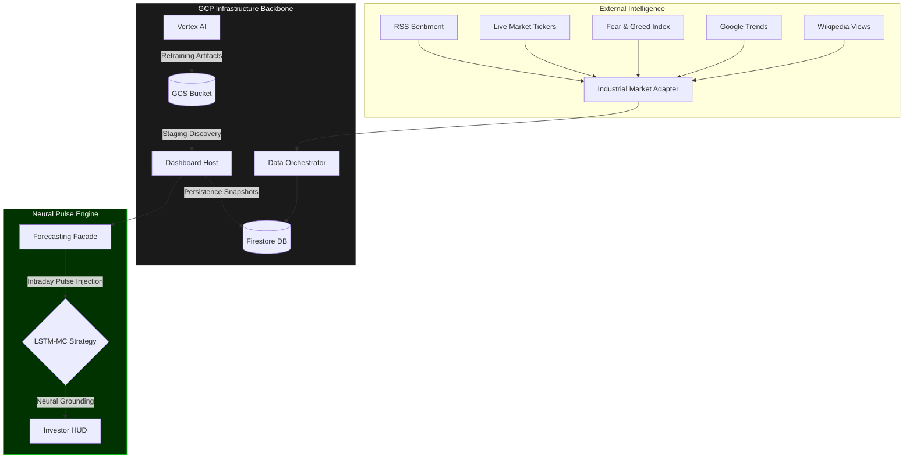
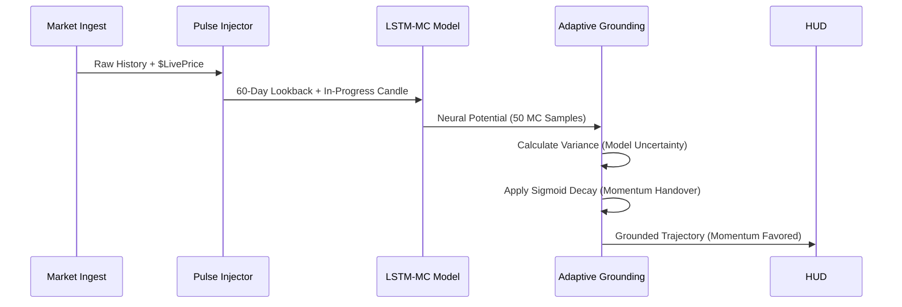

# Industrial Bitcoin Forecasting HUD
**Production Infrastructure & Neural Intelligence Documentation**

## 1. Executive Summary
The Industrial Forecast HUD is a high-precision Bitcoin price projection engine built on a stacked LSTM (Long Short-Term Memory) architecture with Monte Carlo Dropout uncertainty estimation. It synthesizes multi-source data - including VADER sentiment, Google Trends, and Macro-Economic ratios - into a 30-day forecast trajectory.

---

## 2. System Architecture
The platform is designed as a decoupled, three-tier serverless environment in the `us-central1` region.

### 2.1 Global Ecosystem Map (Master Blueprint)


### 2.2 Functional Tiers:
- **Orchestration Layer (Cloud Run)**: A Streamlit-based terminal that handles user interaction and high-speed data stitching.
- **Neural Compute (Vertex AI)**: Autonomous custom training jobs running on optimized Docker containers. This tier is isolated from inference to ensure zero-latency.
- **Persistence Tier (Firestore)**: Manages the global state, tracking the "Neural Bias" and "Adaptive G" values across sessions.
- **Storage Tier (GCS)**: Acts as the neural repository using Recursive Discovery logic for model artifact staging.

---

## 3. The Neural Inference Cycle
The project implements a proprietary **"Pulse & Volatility-Weighted Grounding"** logic to ensure predictions are both mathematically accurate and reactive to market momentum.

### 3.1 Adaptive Grounding Flow


- **Pulse Injection**: Injects the current "unclosed" daily price into position 59 of the 60-day LSTM lookback window.
- **Sentiment Isolation**: Live RSS sentiment is isolated strictly to the inference row, preventing the forward-fill leakage that often plagues technical analysis models.
- **MC Dropout**: Runs 50 iterations per forecast to generate the standard deviation bands (the "Confidence Tunnel").

---

## 4. Automation & MLOps

### 4.1 Rapid Deployment Strategy (Multi-Stage)

The system has shifted from a heavy, monolithic container strategy to a high-speed **Multi-Stage Build** architecture.

| Feature | Legacy Approach (Single-Stage) | New Approach (Multi-Stage) |
| :--- | :--- | :--- |
| **Image Size** | ~1.8GB - 2.5GB | **< 600MB** |
| **Build Time** | 8-12 minutes | **3-5 minutes** (due to cached layers) |
| **Cold Starts** | High (High latency for Cloud Run) | **Minimal** (Fast container spin-up) |
| **Security** | Contains build-tools (`gcc`, `make`) | **Lean Runtime Only** (No build-time binaries) |
| **Registry Cost** | High (Large storage footprint) | **Low** (Optimized artifact size) |

- **Stage 1 (Builder)**: A heavy `python-slim` environment that installs `build-essential`, compiles dependencies, and fetches Pip packages.
- **Stage 2 (Runtime)**: A clean `python-slim` base that only inherits the finalized `site-packages`. This removes several hundred megabytes of temporary cache and compiler overhead, resulting in a production-ready image.

### 4.2 Artifact Recovery & Sync
The **Lifecycle Facade** manages the cloud handshake:
1.  **Discovery**: Recursive scan of the `staging_bucket`.
2.  **Verification**: Sorting blobs by `Updated` timestamp.
3.  **Promotion**: Downloading the newest `.h5` and `.pkl` files to the local `models/` folder.

---

## 5. Database Architecture (Firestore: `btc-pred-db`)

### 5.1 Collection: `snapshots` (Persistence Logic)
| Field | Type | Description |
| :--- | :--- | :--- |
| `dates` | Array[String] | ISO-8601 strings for the 30-day forecast. |
| `prices` | Array[Float] | Neural mean price projections (grounded). |
| `std` | Array[Float] | Confidence interval widths (MC Sigma). |
| `avg_drift` | Float | The calculated Model-Market bias at time of inference. |
| `timestamp` | Timestamp | Server-side creation time. |

---

## 6. Real-Time Diagnostics: Neural Reactivity Audit
Integrated into the `ForecastingFacade` is a **Neural Reactivity Monitor**. Each fresh inference logs:
- **Neural Bias**: Mathematical gap between raw neural expectation and market reality.
- **Model Variance**: Real-time uncertainty detected via Monte Carlo Dropout.
- **Adaptive G**: The dynamic grounding factor (0.1 to 0.5) that determines how much the model follows price vs its own trajectory.

---

## 7. Operational Commands
- **Launch HUD Local**: `.\venv\Scripts\streamlit run src/main_dashboard.py`
- **Hardened Deploy**: `.\scripts\deploy_all.ps1` (Loads secrets from `.env`)
- **Sync Weights**: `python src/main_trainer.py` (Local retrain to align 12-feature schema)

---

## 8. Data Ingestion Pipeline

### 8.1 Macro Gravity Schema (Strict 12 Features)
The system is built on a fixed-order tensor to ensure scaler-model integrity.

| Index | Feature | Calculation / Refinement |
| :--- | :--- | :--- |
| 0-4 | `OHLCV` | Raw yfinance daily candles. |
| 5 | `BTC_ETH_Ratio` | Cross-asset network value proxy. |
| 6 | `BTC_Gold_Ratio` | Store-of-value saturation proxy. |
| 7 | `DXY` | US Dollar Index (Macro). |
| 8 | `US10Y` | 10-Year Treasury yield (Macro). |
| 9 | `RSI` | 14-day Relative Strength Index. |
| 10 | `Sentiment` | Daily Fear and Greed Index. |
| 11 | `Google_Trends` | **Adaptive Scaling**: Wiki Views (Peak+20% Buffer) x RSS VADER. |

### 8.2 Ingestion Refinements
- **Adaptive Peak Scaling (F-01)**: Replaced static normalization with dynamic peak-tracking for Wikipedia views (Historical Peak * 1.2 buffer). This prevents feature saturation during curiosity spikes.
- **Stitch Yesterday Gap (P-03)**: Implements timezone-aware gap recovery to ensure yesterday's candle is present before today's pulse is injected.
- **Temporal Guard**: Enforced 10:00 UTC guard to prevent model ingestion of unstable intraday noise during high-volatility opens.

---

## 9. Model Inference Mechanism

### 9.1 Volatility-Weighted Grounding (F-03)
Raw neural output is anchored to the live market price using a dynamic **Grounding Factor (G)**:
```python
expected_variance = (MC_STD[0] / Mean[0]) * 100
if expected_variance > 2.5%:
    adaptive_g = BASE_G * exp(-(diff) / 5.0)  # Decay G to favor Neural Model
```
During periods of high uncertainty (high variance), the system automatically grants the Neural Model more autonomy, allowing the trajectory to diverge from current price if the neurons detect a strong directional breakout.

### 9.2 Sigmoid Handover
Grounding decay uses a sigmoid-like curve (`1 / (1 + exp(x - 5))`) rather than linear decay. This preserves the "Neural Momentum" early in the forecast while ensuring a smooth transition between anchored and autonomous states.

---
*STABLE VERSION: 2026.04.16 - Hardening Phase Complete (Refinements F-01 to F-03 & P-03)*
