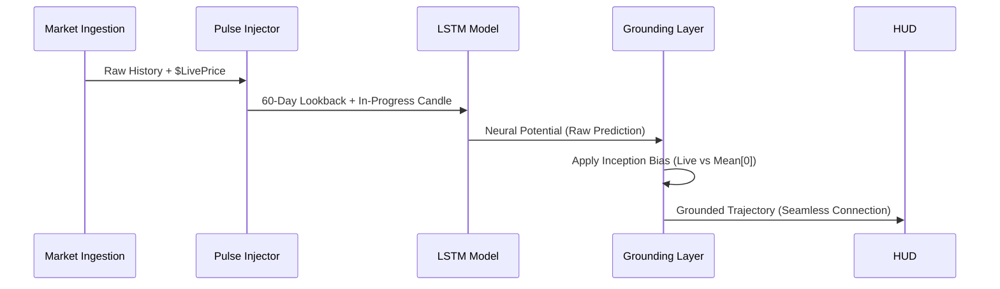
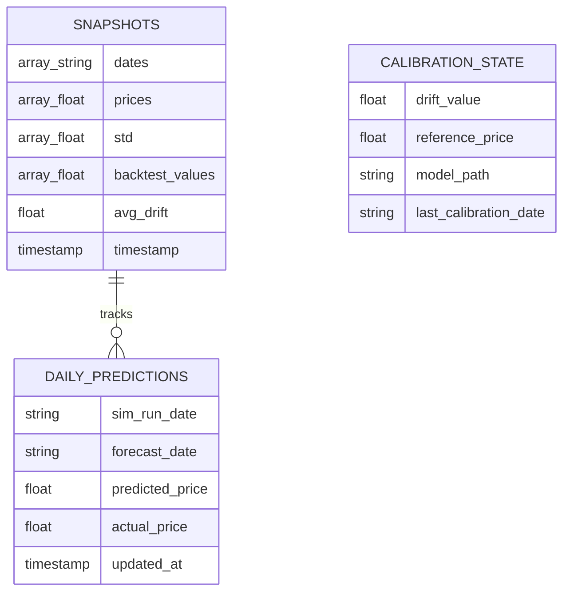

# Industrial Bitcoin Forecasting HUD
**Production Infrastructure & Neural Intelligence Documentation**

## 1. Executive Summary
The Industrial Forecast HUD is a high-precision Bitcoin price projection engine built on a stacked LSTM (Long Short-Term Memory) architecture with Monte Carlo Dropout uncertainty estimation. It synthesizes multi-source data—including VADER sentiment, Google Trends, and Macro-Economic ratios—into a 30-day forecast trajectory.

---

## 2. System Architecture
The platform is designed as a decoupled, three-tier serverless environment in the `us-central1` region.

### 2.1 Global Ecosystem Map (Master Blueprint)

### 2.2 Functional Tiers:
- **Orchestration Layer (Cloud Run)**: A Streamlit-based terminal that handles user interaction and high-speed data stitching.
- **Neural Compute (Vertex AI)**: Autonomous custom training jobs running on `n1-standard-4`. This tier is isolated from inference to ensure zero-latency for the HUD.
- **Persistence Tier (Firestore)**: Manages the global state, tracking the "Neutral Bias" and "Drift Calibration" values across sessions.
- **Storage Tier (GCS)**: Acts as the neural repository. It uses a **Recursive Discovery** logic to identify the latest training artifacts within the staging bucket.

---

## 3. The Neural Inference Cycle
The project implements a proprietary "Pulse & Grounding" logic to ensure predictions are both mathematically accurate and visually continuous.

### 3.1 Pulse Injection & Grounding Flow

- **Pulse Injection**: Injects the current "unclosed" daily price into the LSTM's lookback window. This allows the neurons to react to intraday breakouts.
- **Neural Grounding**: Anchors the forecast Mean exactly to the last known market price, while preserving the predicted trajectory shape (Predictive Freedom).
- **MC Dropout**: Runs 50 iterations per forecast to generate the standard deviation bands (the "Confidence Tunnel").

---

## 4. Automation & MLOps
The system maintains its own health through a series of automated handshakes:

### 4.1 Artifact Recovery & Sync
If local models or scalers are deleted or detected as stale, the **Lifecycle Facade** initiates a Cloud Handshake:
1.  **Discovery**: Recursive scan of the `staging_bucket`.
2.  **Verification**: Sorting blobs by `Updated` timestamp.
3.  **Promotion**: Downloading the newest `.h5` and `.pkl` files to the local `models/` folder.

---

## 5. Database Architecture (Firestore: `btc-pred-db`)
The system uses Google Cloud Firestore in native mode for high-availability state persistence.

### 5.1 Data Topology (ER Diagram)

The database is structured into three primary collections:

### 5.1 Collection: `snapshots`
**Purpose**: High-speed recovery and caching of the complete HUD state.
| Field | Type | Description |
| :--- | :--- | :--- |
| `dates` | Array[String] | ISO-8601 strings for the 30-day forecast timeline. |
| `prices` | Array[Float] | Neural mean price projections for each date. |
| `std` | Array[Float] | Confidence interval widths (Monte Carlo Sigma). |
| `backtest_values` | Array[Float] | Historical model performance vector for the HUD. |
| `avg_drift` | Float | The calculated Model-Market bias at time of inference. |
| `timestamp` | Timestamp | Server-side creation time for cache invalidation. |

### 5.2 Collection: `daily_predictions`
**Purpose**: Longitudinal performance tracking and accuracy auditing.
| Field | Type | Description |
| :--- | :--- | :--- |
| `sim_run_date` | String | YYYYMMDD identifier for the training/inference run. |
| `forecast_date` | String | The specific calendar date being targeted. |
| `predicted_price` | Float | The raw neural output for that specific date. |
| `actual_price` | Float | The verified market close (updated via hourly sync). |
| `updated_at` | Timestamp | Last update time for the truth-matching pass. |

### 5.3 Collection: `calibration_state`
**Purpose**: Neural persistence and model-market grounding tracking.
| Field | Type | Description |
| :--- | :--- | :--- |
| `drift_value` | Float | The active sentiment-adjusted bias factor. |
| `reference_price` | Float | The BTC price used as the grounding baseline. |
| `model_path` | String | The GCS URI of the model asset used for the state. |
| `last_calibration_date`| String | Human-readable timestamp of the last realignment. |

---

## 6. Real-Time Diagnostics
Integrated into the `ForecastingFacade` is a **Neural Reactivity Monitor**. This tool provides real-time terminal logging of:
- **Neural Bias**: The mathematical gap between the model's raw expectation and current market reality.
- **7-Day Momentum**: The neural slope of the forecast trajectory.
- **Scaling Invariants**: Verification that input features are within the expected Z-score distribution.

---

## 7. Operational Commands
- **Run Dashboard**: `streamlit run src/main_dashboard.py`
- **Audit Reactivity**: Observe the terminal output during a "Force Refresh" for the Neural Reactivity Audit block.
- **Sync Models**: Use the "Synchronize Model Assets" button in the sidebar to pull the latest staging-bucket artifacts.

---
*STABLE VERSION: 2026.04.13 - Industrial Stabilization & Security Update*
