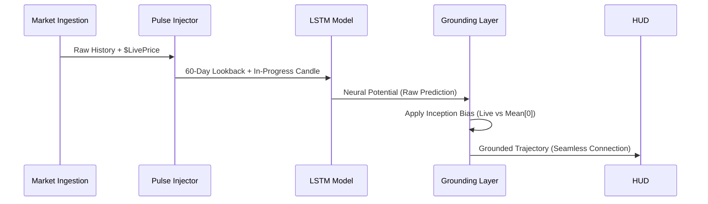
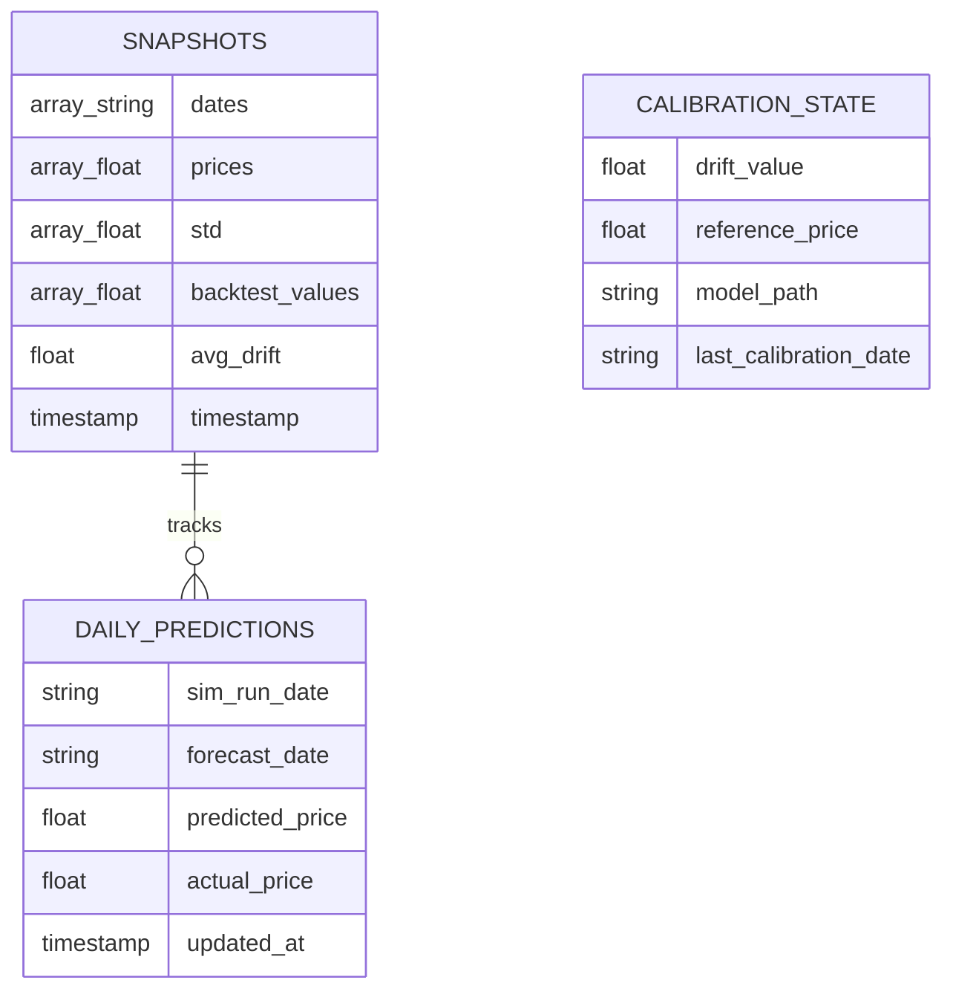

# Industrial Bitcoin Forecasting HUD
**Production Infrastructure & Neural Intelligence Documentation**

## 1. Executive Summary
The Industrial Forecast HUD is a high-precision Bitcoin price projection engine built on a stacked LSTM (Long Short-Term Memory) architecture with Monte Carlo Dropout uncertainty estimation. It synthesizes multi-source data - including VADER sentiment, Google Trends, and Macro-Economic ratios - into a 30-day forecast trajectory.

---

## 2. System Architecture
The platform is designed as a decoupled, three-tier serverless environment in the `us-central1` region.

### 2.1 Global Ecosystem Map (Master Blueprint)


### 2.2 Functional Tiers:
- **Orchestration Layer (Cloud Run)**: A Streamlit-based terminal that handles user interaction and high-speed data stitching.
- **Neural Compute (Vertex AI)**: Autonomous custom training jobs running on `n1-standard-4`. This tier is isolated from inference to ensure zero-latency for the HUD.
- **Persistence Tier (Firestore)**: Manages the global state, tracking the "Neutral Bias" and "Drift Calibration" values across sessions.
- **Storage Tier (GCS)**: Acts as the neural repository. It uses a **Recursive Discovery** logic to identify the latest training artifacts within the staging bucket.

---

## 3. The Neural Inference Cycle
The project implements a proprietary "Pulse & Grounding" logic to ensure predictions are both mathematically accurate and visually continuous.

### 3.1 Pulse Injection & Grounding Flow


- **Pulse Injection**: Injects the current "unclosed" daily price into the LSTM's lookback window. This allows the neurons to react to intraday breakouts.
- **Neural Grounding**: Anchors the forecast Mean exactly to the last known market price, while preserving the predicted trajectory shape (Predictive Freedom).
- **MC Dropout**: Runs 50 iterations per forecast to generate the standard deviation bands (the "Confidence Tunnel").

---

## 4. Automation & MLOps
The system maintains its own health through a series of automated handshakes:

### 4.1 Artifact Recovery & Sync
If local models or scalers are deleted or detected as stale, the **Lifecycle Facade** initiates a Cloud Handshake:
1.  **Discovery**: Recursive scan of the `staging_bucket`.
2.  **Verification**: Sorting blobs by `Updated` timestamp.
3.  **Promotion**: Downloading the newest `.h5` and `.pkl` files to the local `models/` folder.

---

## 5. Database Architecture (Firestore: `btc-pred-db`)
The system uses Google Cloud Firestore in native mode for high-availability state persistence.

### 5.1 Data Topology (ER Diagram)


The database is structured into three primary collections:

### 5.1 Collection: `snapshots`
**Purpose**: High-speed recovery and caching of the complete HUD state.
| Field | Type | Description |
| :--- | :--- | :--- |
| `dates` | Array[String] | ISO-8601 strings for the 30-day forecast timeline. |
| `prices` | Array[Float] | Neural mean price projections for each date. |
| `std` | Array[Float] | Confidence interval widths (Monte Carlo Sigma). |
| `backtest_values` | Array[Float] | Historical model performance vector for the HUD. |
| `avg_drift` | Float | The calculated Model-Market bias at time of inference. |
| `timestamp` | Timestamp | Server-side creation time for cache invalidation. |

### 5.2 Collection: `daily_predictions`
**Purpose**: Longitudinal performance tracking and accuracy auditing.
| Field | Type | Description |
| :--- | :--- | :--- |
| `sim_run_date` | String | YYYYMMDD identifier for the training/inference run. |
| `forecast_date` | String | The specific calendar date being targeted. |
| `predicted_price` | Float | The raw neural output for that specific date. |
| `actual_price` | Float | The verified market close (updated via hourly sync). |
| `updated_at` | Timestamp | Last update time for the truth-matching pass. |

### 5.3 Collection: `calibration_state`
**Purpose**: Neural persistence and model-market grounding tracking.
| Field | Type | Description |
| :--- | :--- | :--- |
| `drift_value` | Float | The active sentiment-adjusted bias factor. |
| `reference_price` | Float | The BTC price used as the grounding baseline. |
| `model_path` | String | The GCS URI of the model asset used for the state. |
| `last_calibration_date`| String | Human-readable timestamp of the last realignment. |

---

## 6. Real-Time Diagnostics
Integrated into the `ForecastingFacade` is a **Neural Reactivity Monitor**. This tool provides real-time terminal logging of:
- **Neural Bias**: The mathematical gap between the model's raw expectation and current market reality.
- **7-Day Momentum**: The neural slope of the forecast trajectory.
- **Scaling Invariants**: Verification that input features are within the expected Z-score distribution.

---

## 7. Operational Commands
- **Run Dashboard**: `streamlit run src/main_dashboard.py`
- **Audit Reactivity**: Observe the terminal output during a "Force Refresh" for the Neural Reactivity Audit block.
- **Sync Models**: Use the "Synchronize Model Assets" button in the sidebar to pull the latest staging-bucket artifacts.
- **Force Data Refresh**: Pass `force_refresh=True` to `data_orchestrator.prepare_dataset()` or use the dashboard Force Market Refresh button to bypass the disk cache and re-ingest all four sources.
- **Rebuild Project Map**: `python scripts/build_project_map.py` from the project root.

---

## 8. Data Ingestion Pipeline

### 8.1 Feature Schema (Macro Gravity - 12 Features)

The LSTM model is trained and inferred on a strict 12-feature tensor. Column order is fixed and must never be changed - the scaler artifact is bound to this exact sequence.

| Index | Feature | Source | Category |
| :--- | :--- | :--- | :--- |
| 0 | `Open` | yfinance `BTC-USD` | Price |
| 1 | `High` | yfinance `BTC-USD` | Price |
| 2 | `Low` | yfinance `BTC-USD` | Price |
| 3 | `Close` | yfinance `BTC-USD` | Target (model output) |
| 4 | `Volume` | yfinance `BTC-USD` | Price |
| 5 | `BTC_ETH_Ratio` | BTC Close / ETH Close | Cross-Asset |
| 6 | `BTC_Gold_Ratio` | BTC Close / Gold Close | Cross-Asset |
| 7 | `DXY` | yfinance `DX-Y.NYB` | Macro |
| 8 | `US10Y` | yfinance `^TNX` | Macro |
| 9 | `RSI` | 14-day rolling BTC Close | Technical |
| 10 | `Sentiment` | alternative.me Fear and Greed API | Sentiment |
| 11 | `Google_Trends` | Wikimedia pageviews x RSS VADER score | Curiosity |

### 8.2 Data Sources

**Price and Macro (yfinance)**: Five assets are downloaded simultaneously: BTC-USD (primary), ETH-USD, GC=F (Gold), DX-Y.NYB (DXY), and ^TNX (US10Y). Macro assets trade only on weekdays; weekend gaps are filled via forward-fill aligned to BTC's 24/7 index. RSI is computed as a 14-day rolling average of the daily Close differential within the adapter.

**Fear and Greed Index (alternative.me)**: Historical daily sentiment covering approximately the last 5.5 years. Output is an integer 0-100. Left-joined to the price index and forward-filled for any missing days. Training runs with `YEARS_HISTORY = 6` will have the first ~6 months carry the earliest available F&G value via forward-fill.

**Wikipedia Pageviews (Wikimedia REST API)**: Daily Bitcoin article pageviews used as a proxy for retail market attention. Responses are min-max normalized to 0-100. No API key is required. Stateless and stable.

**RSS Sentiment Multiplier (VADER)**: Current headlines from CoinTelegraph and CoinDesk RSS feeds are scored via VADER. The compound score (approximately -1.0 to +1.0) is applied as a multiplier to the Wikipedia views signal:
```
Google_Trends = wikipedia_views_normalized * (1 + rss_compound_score)
Google_Trends = clip(Google_Trends, 0, 100)
```

### 8.3 Ingestion Sequence (DataOrchestrator)

```
1. fetch_price_data()        -> yfinance multi-asset pull, RSI derived internally
2. fetch_fng_sentiment()     -> alternative.me API, 0-100 integer daily
3. fetch_wikipedia_views()   -> Wikimedia daily pageviews, normalized 0-100
4. fetch_rss_sentiment()     -> CoinTelegraph + CoinDesk VADER compound score
5. Curiosity Multiplier      -> Google_Trends = wiki * (1 + rss).clip(0, 100)
6. _stitch_yesterday_gap()   -> gap recovery if yfinance misses yesterday close
7. _apply_temporal_guard()   -> drops incomplete today candle if hour < 10
8. enforce_schema()          -> hard 12-feature validation, raises on mismatch
9. Cache -> data/merged_data.csv
```

### 8.4 Disk Cache

If `data/merged_data.csv` exists and contains exactly 12 columns, all four API calls are bypassed on subsequent loads. The cache is invalidated by `force_refresh=True` or a column count mismatch only.

---

## 9. Model Inference Mechanism

### 9.1 Intraday Pulse Injection

Before inference, if the most recent historical row is not from today, the system appends a synthesized live candle:
- `Open = yesterday Close`, `High/Low/Close = current live BTC price`
- `Sentiment = yesterday Sentiment + drift_offset` (clipped 0-100)
- `Google_Trends = yesterday Google_Trends + drift_offset / 2` (clipped 0-100)

This row occupies position 59 (final) of the 60-day LSTM lookback window.

### 9.2 Monte Carlo Dropout Inference

The model is called with `training=True` to keep dropout layers active, generating stochastic variation across 50 independent passes. Each pass produces a 30-day price vector. The final output is the mean and standard deviation across all 50 samples. The confidence bands displayed in the HUD apply an additional `std * 0.5` tightening factor.

### 9.3 Inception Grounding

Raw neural output is anchored to the live market price to eliminate drift from the scaler mean:
```
shift = (live_price * 0.5 + mean[0] * 0.5) - mean[0]
decay = linspace(1.0, 0.0, 30)
mean  = mean + shift * decay
```
Day 0 blends 50% live price and 50% neural. By day 30, the full shift has decayed to zero and the output is pure neural trajectory. The grounding factor is configurable via the `FORECAST_GROUNDING_FACTOR` environment variable.

### 9.4 Neural Reactivity Audit

Each fresh inference logs the following diagnostic block to the terminal:
```
========================================
--- NEURAL REACTIVITY AUDIT ---
Target Period:  YYYY-MM-DD
Live Price:     $XX,XXX.XX
Raw Model Obs:  $XX,XXX.XX
Neural Bias:    $+/-X,XXX.XX (+/-X.XX%)
Shape Freedom:  7-Day Momentum = +/-X.XX%
========================================
```
A large Neural Bias indicates the model's internal expectation has drifted significantly from current market reality and may warrant recalibration.

---
*STABLE VERSION: 2026.04.15 - Pipeline Audit and Documentation Update*
