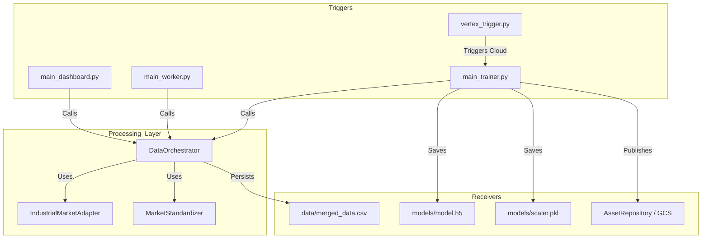

# Pipeline Interaction Audit & Mapping

This document maps the flow of data and control across the BTC Predictor's pipelines, identifying the code files responsible for triggering, processing, and receiving data.

## 1. Interaction Map

## 2. Pipeline Definitions

### A. Ingestion (ETL)
*   **Triggers**: `main_dashboard.py` (On load or Force Refresh), `main_worker.py` (Periodic).
*   **Processor**: `src/core/data_orchestrator.py`.
*   **Receiver**: `data/merged_data.csv`.
*   **Context**: Fetches from yfinance, alternative.me, and Wikimedia.

### B. Training
*   **Triggers**: `main_trainer.py` (Local), `vertex_trigger.py` (Cloud).
*   **Processor**: `src/main_trainer.py`.
*   **Receiver**: `models/` directory / GCS Bucket.
*   **Context**: Fits `MinMaxScaler`, trains LSTM, and saves artifacts for inference.

### C. Inference
*   **Triggers**: `main_dashboard.py` (Prediction call).
*   **Processor**: `src/main_dashboard.py` (via `MC Dropout` logic).
*   **Receiver**: UI Elements.
*   **Context**: Uses `models/model.h5` and `models/scaler.pkl`.

### D. Deployment
*   **Triggers**: Manual agent mission via `/gcp`.
*   **Processor**: `src/vertex_trigger.py`.
*   **Receiver**: Vertex AI Custom Jobs.
